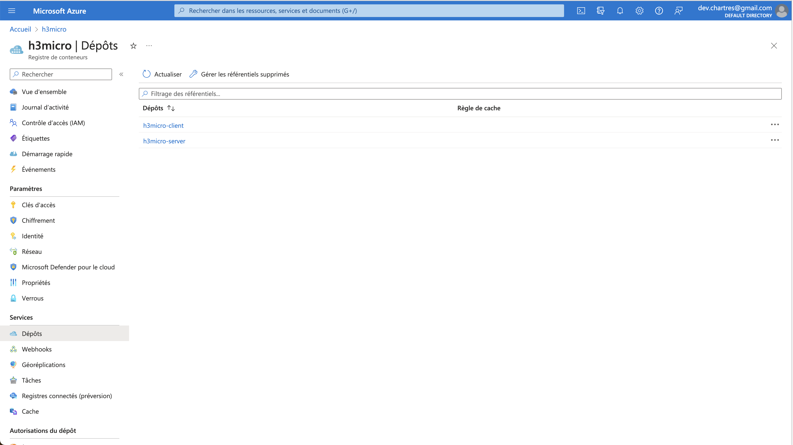
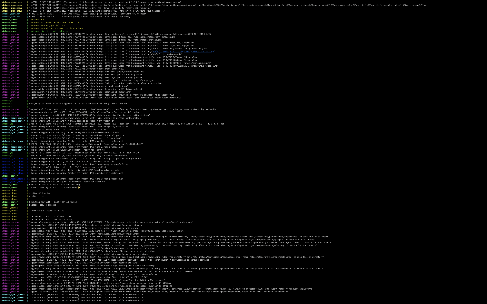

Certainly, here is the improved text with the suggested enhancements:

---

## Rationale for Choosing React and Express in the Client and Server Services

In the "h3micro" project, the choice of React for the client and Express for the server services is a thoughtful decision, aligning with best practices for modern web application development. Let's explore the reasons behind these technology choices and assess their compatibility.

### React for the Client Service

1. **User Interface Development:** React is a widely adopted JavaScript library for building user interfaces. It's known for its component-based architecture, which enables developers to create interactive and dynamic user interfaces with ease.

2. **Declarative Approach:** React's declarative approach to building UIs simplifies the process of designing complex, data-driven interfaces. This leads to more maintainable and predictable code.

3. **Reusability:** React's component reusability allows developers to create a set of UI components that can be used across the application, reducing redundancy and making development more efficient.

4. **Ecosystem:** React has a thriving ecosystem with a wealth of third-party libraries and tools, making it well-suited for the rapid development of modern web applications.

5. **Virtual DOM:** React's Virtual DOM helps optimize performance by efficiently updating only the parts of the UI that have changed. This results in a smoother user experience.

**Express for the Server Service**

1. **Node.js Integration:** Express is a minimal, unopinionated web framework for Node.js, making it well-suited for building server-side applications. Node.js is known for its asynchronous, non-blocking I/O, which can handle a large number of concurrent connections efficiently.

2. **Middleware Support:** Express offers a robust middleware system, allowing developers to easily integrate additional functionality into the server, such as authentication, routing, and request processing.

3. **Scalability:** Express is designed to be lightweight and flexible, making it a great choice for building scalable APIs. It can be used as a foundation for building RESTful APIs or handling server-side logic.

4. **Community and Packages:** The Express.js community is extensive, and there are numerous packages and middleware readily available. This facilitates faster development and integration with other services and technologies.

5. **Security:** Express provides mechanisms for implementing security best practices, such as input validation and protection against common web vulnerabilities.

**Compatibility:**

React and Express are highly compatible with each other, particularly in a setup where React is used for the client-side user interface, and Express serves as the server. This compatibility is based on the following considerations:

1. **RESTful API:** Express can be used to create a RESTful API that communicates with the React front-end. React components can make HTTP requests to the Express API endpoints, enabling data exchange between the client and server.

2. **JSON Communication:** Both React and Express support JSON, which is a common data format for data exchange. This allows for seamless communication between the client and server.

3. **Middleware:** Express's middleware system can be utilized for implementing features like authentication, routing, and serving static files, which are essential for a full-stack web application.

4. **Scalability:** The combination of React and Express allows for a scalable architecture, as the server can be scaled independently from the client to handle increased traffic.

In summary, the choice of React and Express forms a powerful synergy, where React excels in building dynamic user interfaces and Express serves as a robust foundation for server-side logic. Together, they enable the development of efficient and feature-rich web applications. However, to ensure a seamless interaction between the client and server, careful attention should be given to API design and data flow.

Certainly, let's explore the technology choices and compatibility of the other services defined in the "h3micro" Docker Compose configuration.

### Reverse Proxy Services (reverse_proxy_server and reverse_proxy_client)

**Technology Choice: Nginx as a Reverse Proxy**

1. **Load Balancing:** Nginx is a high-performance, open-source web server and reverse proxy server. It's chosen for load balancing and distributing incoming requests effectively to the client and server services, which is crucial for ensuring high availability and scalability.

2. **SSL Termination:** Nginx is equipped to handle SSL termination, which is vital for handling secure connections. It can offload the SSL encryption and decryption process from the client and server services, reducing their workload.

3. **Custom Configuration:** The use of custom Nginx configuration files allows for fine-tuned control over routing and security settings. This flexibility is beneficial for customizing the reverse proxy's behavior.

4. **Security and Performance:** Nginx is highly regarded for its performance and security features, making it an excellent choice for handling client and server requests while optimizing resource usage.

**Compatibility:**

Nginx is highly compatible with both client (React) and server (Express) services. It acts as an intermediary, directing incoming requests to the appropriate service based on the configuration. Since it supports HTTP and HTTPS, it can handle both types of traffic coming from the client and route them accordingly to the corresponding services.

### Monitoring and Observability Services (cadvisor, Grafana, and Prometheus)

**Technology Choices: cAdvisor, Grafana, and Prometheus**

1. **cAdvisor:** cAdvisor is an open-source container monitoring tool that provides real-time insights into container resource utilization and performance. It's selected for its ability to collect data from Docker containers, making it an essential component for monitoring the health and performance of the microservices architecture.

2. **Grafana:** Grafana is a popular open-source platform for monitoring and observability. It provides a rich and user-friendly interface for creating customizable dashboards, enabling visual representation of metrics from various sources, including cAdvisor and Prometheus.

3. **Prometheus:** Prometheus is an open-source monitoring and alerting toolkit designed for reliability and scalability. It is chosen for its capability to scrape and store metrics, making it a suitable solution for long-term data retention and generating alerts based on predefined conditions.

**Compatibility:**

-   cAdvisor seamlessly integrates with Docker containers and provides metrics that can be monitored and visualized by Grafana. The metrics collected by cAdvisor, such as CPU and memory usage, are essential for optimizing containerized applications.

-   Grafana can connect to various data sources, including Prometheus, making it highly compatible with the other services. It is used to create dynamic dashboards and visually represent the data collected by cAdvisor and Prometheus, providing real-time insights into the system's performance.

-   Prometheus collects and stores metrics from various services, including cAdvisor, and provides a powerful querying language for extracting data. It integrates well with Grafana for visualization and alerting purposes.

**Conclusion:**

In the rapidly evolving landscape of web development, the judicious selection of a technology stack plays a pivotal role in achieving project goals. The "h3micro" project's choice of technologies, as outlined here, sets a strong foundation for building efficient, feature-rich web applications. To ensure the continued success of the "h3micro" project, it's crucial to consider real-world use cases, potential limitations, and strategies for scaling the architecture as demands grow. Regular updates and monitoring of the chosen technologies will also contribute to the long-term success of this project.

For readers interested in exploring these technologies further, we recommend referring to official documentation and additional resources specific to React, Express, Nginx, and the monitoring tools mentioned.

**Dockerized services**
The entire application is containerized into microservices, facilitating onboarding new employees and deployment across different cloud providers. The following screenshots offer a glimpse into the setup:

#### Azure Hub

#### Docker Compose in Action

### Development Environment Architecture Schema

Here's an architectural overview of the development environment:

### Generated Schema with `docker-compose-viz`

The schema generated using the `docker-compose-viz` library visually represents the intricate relationships between all the services.

