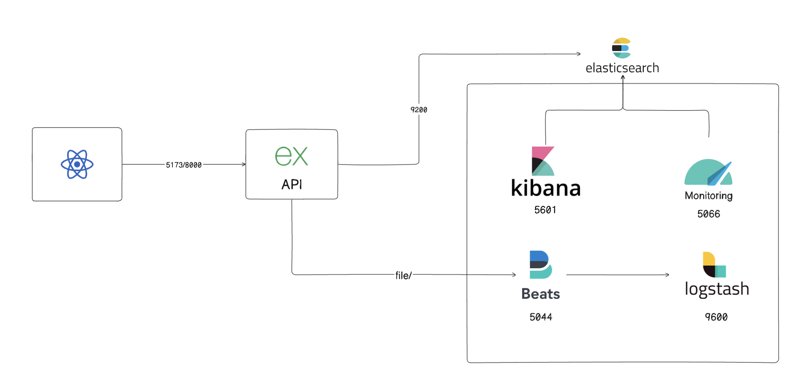
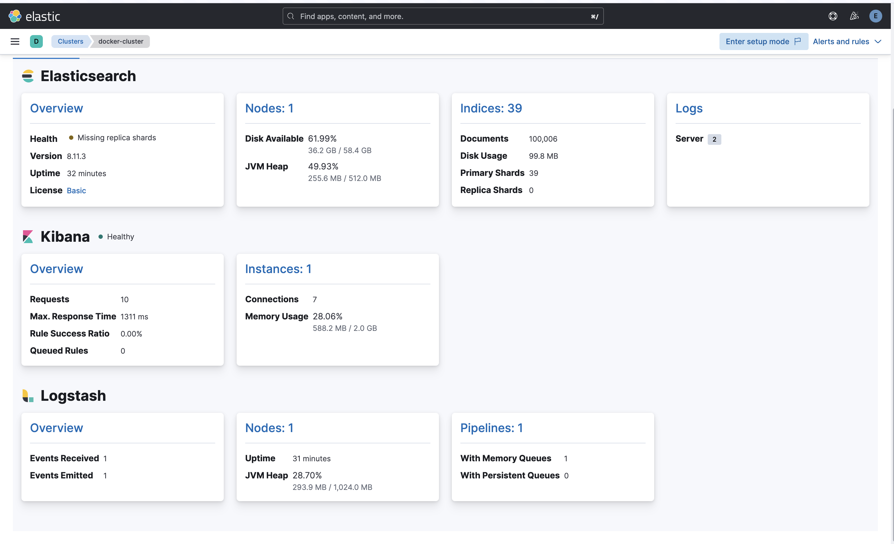
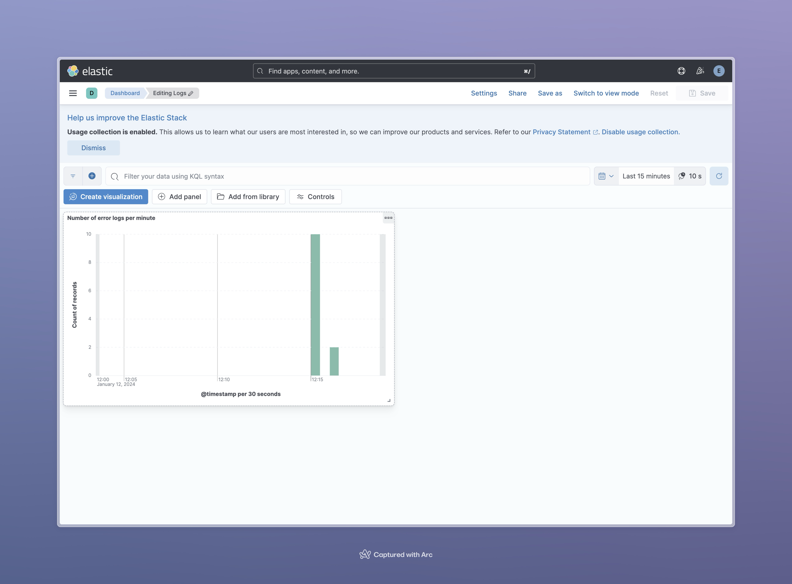

# H3Micro Project README

## IMPORTANT

Please refer to [requirements.md](./requirements.md) for a comprehensive checklist of completed tasks and their status.

---

## Project: H3Micro - Embracing Microservices

### Introduction

Welcome to the H3Micro project! This initiative serves as a live demonstration of microservices architecture, featuring a well-coordinated ecosystem of key components:

-   **Frontend**: Crafted using React.
-   **Backend**: Engineered with Express.js.
-   **Container Network**: Enabling seamless communication among all containers.
-   **Volumes**: Ensuring resilient data persistence across containers.
-   **Reverse Proxy**: Empowered by Nginx to safeguard your connections, complete with HTTPS certificates for both frontend and backend.
-   **Scripts**: Equipped with a range of helpful scripts for Docker health checks, database testing, and comprehensive front-end and back-end testing.

### Prerequisites

Before diving into this project, make sure you have the following prerequisites installed:

-   [Docker](https://www.docker.com/get-started)
-   [Docker Compose](https://docs.docker.com/compose/install)

### Access Links

Explore the various components of this project via the following links:

-   **Frontend**:

    -   HTTP: [http://localhost:5173](http://localhost:5173)

-   **Backend**:

    -   HTTP: [http://localhost:8000](http://localhost:8000)

-   **Backend Documentation**:

    -   HTTP: [http://localhost:8000/api-docs](http://localhost:8000/api-docs)

### Screenshots

### Development Environment Architecture Schema

Here's an architectural overview of the development environment:

### Metricbeat

## Readtime data dashboard

