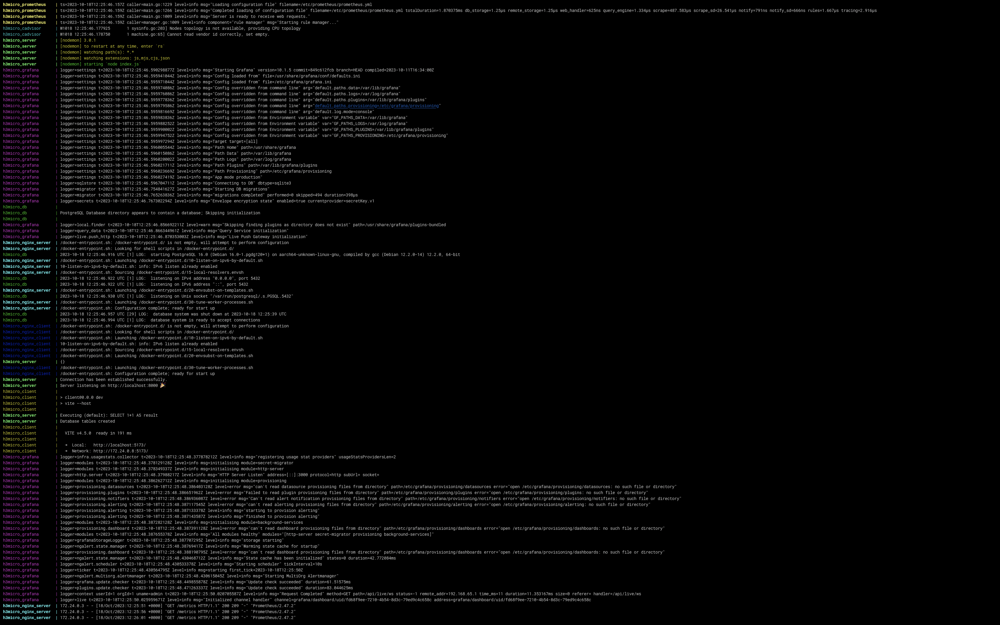

# Project README

## IMPORTANT

In the [requirements.md](./requirements.md), you will find a comprehensive checklist of all completed tasks and their status.

---

## Project: H3Micro

### Introduction

Welcome to the H3Micro project! This endeavor is a live demonstration of microservices architecture, comprising several essential components:

-   **Frontend**: Developed using React.
-   **Backend**: Constructed with Express.js.
-   **Container Network**: Facilitating seamless communication between all containers.
-   **Volumes**: Employed for robust data persistence across containers.
-   **Reverse Proxy**: Powered by Nginx, securing your connections with HTTPS certificates for both frontend and backend.
-   **Scripts**: We've got you covered with helpful scripts for Docker health checks, database testing, and comprehensive front and back-end testing.

### Prerequisites

Before diving into this project, ensure you have the following prerequisites installed:

-   [Docker](https://www.docker.com/get-started)
-   [Docker Compose](https://docs.docker.com/compose/install)

### Links

You can access the various components of this project through the following links:

-   **Frontend**:

    -   HTTP: [http://localhost:5173](http://localhost:5173)
    -   HTTPS: [https://localhost:444](https://localhost:444)

-   **Backend**:

    -   HTTP: [http://localhost:8000](http://localhost:8000)
    -   HTTPS: [https://localhost](https://localhost)

-   **Backend Documentation**:

    -   HTTP: [http://localhost:8000/api-docs](http://localhost:8000/api-docs)
    -   HTTPS: [https://localhost/api-docs](https://localhost/api-docs)

-   **Production**:
    -   Backend: [https://h3microserver.onrender.com](https://h3microserver.onrender.com)
    -   Frontend: [https://h3micro.vercel.app](https://h3micro.vercel.app)

### Screenshots

#### Azure Hub

#### Docker Compose Running

